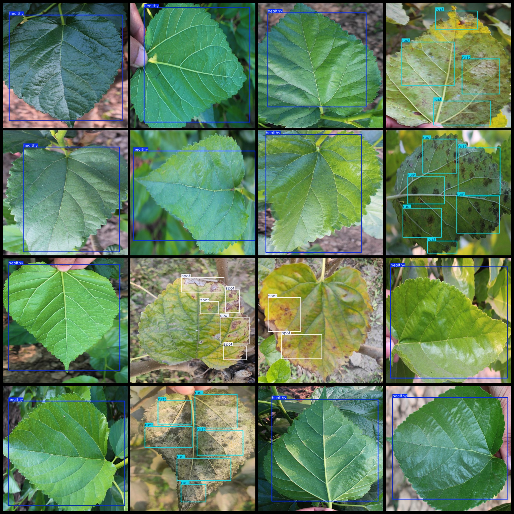
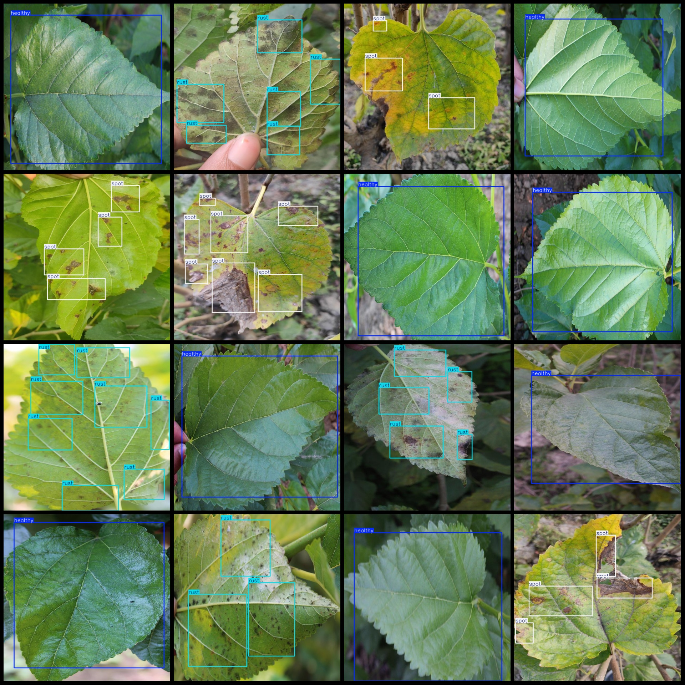

# Sansevieria Leaf Disease Detection Dataset VOC+YOLO format, 1043 images with 3 categories

dataset format: Pascal VOC format + YOLO format (without split path txt files, only including jpg images and corresponding VOC format xml files and yolo format txt files)

Number of images (jpg file counts): 1043
Number of annotations (xml file counts): 1043
Number of annotations (txt file counts): 1043
Number of annotation categories: 3
Annotation categories names (note that the order of yolo format category is not consistent with this, but according to the labels folder classes.txt): ["healthy", "rust", "spot"]
Each category annotations box count:
healthy (Healthy) box count = 423
rust (Rust) box count = 2370
spot (Spot) box count = 647
Total boxes count: 3440
Each category occupied images:
healthy (Healthy) occupied images = 423
rust (Rust) occupied images = 458
spot (Spot) occupied images = 162
Image resolution: 640x640
Using labeling tool: labelImg
Labeling rules: draw rectangle boxes for each category
Important note: The dataset does not have been divided into training, validation, or test sets, which needs to be done by the user.
Special statement: This dataset does not guarantee the accuracy of the trained model or weight files.
Image preview:

Here is a pay link on Stripe ( https://buy.stripe.com/3cs8yP7sY87d0vu9AB ). Please contact me lonlonago@foxmail.com after funding $89, and I will send you a complete data files , thank you!

